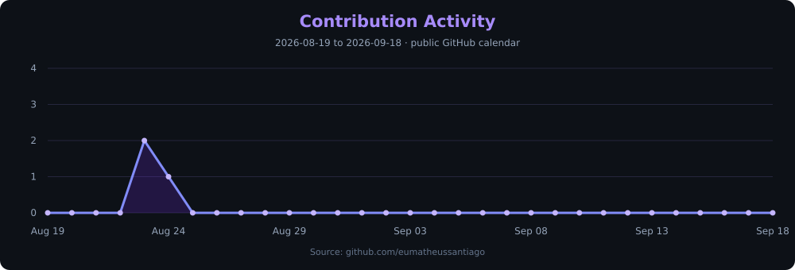

<div align="center">

<a href="https://eumatheussantiago.com">
  
</a>

<a href="https://github.com/eumatheussantiago">
  
</a>

<br />

<a href="https://www.uninove.br"></a>
<a href="https://eumatheussantiago.com"></a>
<a href="https://www.dio.me"></a>

<br /><br />

<a href="https://www.openstreetmap.org/search?query=S%C3%A3o%20Paulo%2C%20Brazil"></a>

<br /><br />

<a href="https://eumatheussantiago.com"></a>
<a href="https://www.linkedin.com/in/eumatheussantiago/"></a>
<a href="mailto:matheussantiagoleandro@gmail.com"></a>
<a href="https://github.com/eumatheussantiago"></a>

<br /><br />

<a href="https://github.com/eumatheussantiago"></a>
<a href="https://github.com/eumatheussantiago?tab=followers"></a>
<a href="https://github.com/eumatheussantiago?tab=repositories"></a>

</div>

---

## About

I'm **Matheus Santiago**, a developer based in **São Paulo, Brazil**, focused on full stack development and software engineering. My background combines **Systems Analysis and Development at UNINOVE**, hands-on software projects, and experience in digital marketing.

I build web applications with attention to architecture, data modeling, APIs, authentication, and the business rules behind each feature. My work on **SuperCash** brings these concerns together in a cashback product with affiliate integrations, rewards, subscriptions, and an internal balance.

My experience with paid media, e-commerce, and conversion helps me connect engineering decisions to user needs. I'm also exploring **AI-assisted development and AI/ML fundamentals**, with an emphasis on understanding and validating the software I build.

**Open to:** software development opportunities, freelance web projects, product collaborations, and open source learning.

---

## Tech Stack

Technologies used across my projects and ongoing technical studies.

### Languages

[](https://github.com/eumatheussantiago?tab=repositories)

### Frontend

[](https://eumatheussantiago.com)

**Also used in current projects:** TanStack Start, TanStack Router, TanStack Query, shadcn/ui, and progressive web app tooling.

### Backend & Databases

[](https://github.com/eumatheussantiago?tab=repositories)

**Project integrations:** REST APIs, Stripe subscriptions, affiliate services, and Supabase authentication.

### Cloud, DevOps & Tooling

[](https://github.com/eumatheussantiago)

**Development workflow:** Lovable, ESLint, Prettier, and Playwright.

---

## AI / ML Expertise

My current emphasis is applied AI-assisted development. Model training and production ML deployment are areas for further study.

| Domain | Proficiency | Details |
|:---|:---|:---|
| AI-assisted development | Practical project use | Using AI tools to help plan, build, and refine web applications, including SuperCash. |
| Requirements and prompting | Practical project use | Translating product goals into scoped tasks, business rules, and acceptance criteria. |
| AI output validation | Developing practice | Reviewing generated behavior against requirements and investigating gaps through technical audits. |
| Python for AI / ML | Foundational | Building on Python knowledge while exploring the foundations of AI and machine learning. |
| Model training and MLOps | Exploration | A learning direction; no production model deployment is claimed here. |

---

## Featured Projects

<details open>
<summary><strong>SuperCash | Cashback & Rewards Platform</strong></summary>

<br />

A Brazilian cashback and coupon product that connects offer discovery, affiliate tracking, rewards, and account management.

| Dimension | Details |
|:---|:---|
| **Stack** | TypeScript, React, TanStack Start, Tailwind CSS, Supabase, PostgreSQL, Stripe, and Capacitor. |
| **Scale** | MVP with public browsing, individual accounts, and administrative workflows. |
| **Performance** | Server-side rendering and client-side query management; large-scale performance has not been benchmarked. |
| **Security** | Supabase authentication, row-level security, and role checks; controls continue to be reviewed and validated. |
| **Impact** | Brings coupons, cashback tracking, VIP benefits, and withdrawal requests into one product. |
| **Repository** | Private source code. Explore the [public product](https://supercashapp.com.br) or [contact me](mailto:matheussantiagoleandro@gmail.com) about the engineering work. |

The engineering challenge is consistency across affiliate events, reward balances, subscription state, and withdrawal handling. The MVP uses an **internal rewards balance and manually processed PIX withdrawals**. It is under active development, with the complete affiliate-purchase-to-withdrawal journey still being validated.

</details>

<br />

<details>
<summary><strong>Professional Portfolio | Web Development & Digital Services</strong></summary>

<br />

My professional website brings together software projects, service pages, experience, and contact channels.

| Dimension | Details |
|:---|:---|
| **Stack** | TypeScript, React, TanStack Start, Tailwind CSS, and Supabase. |
| **Scale** | Personal portfolio with Portuguese and English content, dedicated service pages, and administrative tools. |
| **Performance** | Server-rendered routes and reusable components; no public performance benchmark is claimed. |
| **Security** | Authentication and administrative access checks are part of the implementation. |
| **Impact** | Connects technical work with the services and outcomes a potential client needs. |
| **Repository** | Private source code. Visit [eumatheussantiago.com](https://eumatheussantiago.com). |

This project applies a product mindset to my own professional presence: clear information, reusable content, service discovery, and a direct path to contact.

</details>

<br />

<details>
<summary><strong>Agregador de Links | Personal Link Hub</strong></summary>

<br />

A focused landing page that organizes professional links, services, and social profiles.

| Dimension | Details |
|:---|:---|
| **Stack** | HTML, CSS, and JavaScript. |
| **Scale** | Static, single-page project. |
| **Performance** | Browser-native implementation without an application framework; no measured speed claim. |
| **Security** | External links use `noopener noreferrer`; the page does not require an account. |
| **Impact** | Provides a central entry point to my work and professional channels. |
| **Repository** | [eumatheussantiago/agregador-de-links](https://github.com/eumatheussantiago/agregador-de-links) |

The project explores semantic HTML, responsive presentation, theme switching, language selection, and accessible navigation labels in a compact interface.

</details>

<br />

<details>
<summary><strong>UNINOVE MVC | Academic Web Application</strong></summary>

<br />

An academic project exploring the Model-View-Controller structure in the .NET ecosystem.

| Dimension | Details |
|:---|:---|
| **Stack** | C#, ASP.NET Core MVC, Razor, HTML, and CSS. |
| **Scale** | Academic application with controller and view organization. |
| **Performance** | Server-rendered pages; no load testing results are published. |
| **Security** | Educational scope; no production security assurance is claimed. |
| **Impact** | Builds practical understanding of request routing, presentation, and application structure. |
| **Repository** | [eumatheussantiago/trabalho_MVC_2026](https://github.com/eumatheussantiago/trabalho_MVC_2026) |

The repository documents hands-on practice with controller actions, Razor views, shared layouts, and the organization of a server-side web application.

</details>

---

## Experience

### Web Development | Independent & Academic Projects

**2026 - Present**

Building personal and academic applications while developing practical software engineering skills and a product-oriented approach to implementation.

- Work on SuperCash, a cashback product with affiliate integrations, rewards, subscriptions, and account workflows.
- Develop a professional portfolio and service pages with React, TypeScript, and backend integrations.
- Practice web application structure through C# and ASP.NET Core MVC coursework.
- Refine requirements and review behavior through iterative development and technical audits.


### Digital Strategy & Paid Media | Freelance

**Project-based experience**

Experience with paid traffic, digital campaigns, sales funnels, and e-commerce. This background informs how I think about user journeys, conversion, and the business purpose of software.

- Plan campaigns and audience strategies for Meta Ads and Google Ads.
- Develop campaign copy, landing page content, and lead generation funnels.
- Analyze campaign results and communicate findings to clients.
- Connect acquisition, offer design, and customer experience.


---

## Achievements

<div align="center">

| Recognition | Details |
|:---|:---|
| **Product development** | Building SuperCash around a concrete cashback and rewards use case. |
| **Public technical portfolio** | Sharing web projects and academic development work on GitHub. |
| **Business perspective** | Bringing paid media, e-commerce, and conversion experience into software decisions. |
| **Continuous learning** | Combining UNINOVE studies, DIO courses, and practical project development. |

</div>

---

## Certifications

### DIO

[](https://www.dio.me)

Continuing education in technology through DIO. Individual credential links are not currently listed here.

<details>
<summary><strong>AWS · Oracle · NPTEL · Cisco | Certification resources</strong></summary>

<br />

The links below are provider catalogs, not certifications I claim to hold.

### AWS

[](https://aws.amazon.com/certification/)

### Oracle

[](https://education.oracle.com/certification)

### NPTEL

[](https://nptel.ac.in)

### Cisco

[](https://www.cisco.com/site/us/en/learn/training-certifications/certifications/index.html)

</details>

---

## Coding Profiles

<p align="center">Practice platforms. Personal challenge profiles are not linked yet.</p>

<p align="center">
  <a href="https://leetcode.com"></a>
  <a href="https://www.geeksforgeeks.org"></a>
  <a href="https://www.hackerrank.com"></a>
  <a href="https://www.codechef.com"></a>
</p>

---

## GitHub Analytics

<p align="center">
  <a href="https://github.com/eumatheussantiago">
    
  </a>
  <a href="https://github.com/eumatheussantiago?tab=repositories">
    
  </a>
</p>

<p align="center">
  <a href="https://github.com/eumatheussantiago">
    
  </a>
</p>

<p align="center"><sub>Public activity only. Language proportions describe repository content, not proficiency.</sub></p>

---

## GitHub Trophies

<p align="center">
  <a href="https://github.com/ryo-ma/github-profile-trophy">
    
  </a>
</p>

---

## Contribution Activity

<p align="center">
  <a href="https://github.com/eumatheussantiago">
    
  </a>
</p>

---

## Contribution Snake

<p align="center">
  <a href="https://github.com/eumatheussantiago">
    <picture>
      <source media="(prefers-color-scheme: dark)" srcset="assets/github-snake-dark.svg" />
      <source media="(prefers-color-scheme: light)" srcset="assets/github-snake.svg" />
      
    </picture>
  </a>
</p>

<p align="center"><sub>Updated by the <a href="https://github.com/eumatheussantiago/eumatheussantiago/actions/workflows/profile-widgets.yml">contribution animation workflow</a>, powered by <a href="https://github.com/Platane/snk">snk</a>.</sub></p>

---

## Current Focus

```yaml
Learning:
  - Software architecture and maintainable application design
  - Automated testing and reliable API integrations
  - AI and machine learning fundamentals

Building:
  - SuperCash cashback and rewards workflows
  - A professional portfolio connected to real projects
  - Web applications with TypeScript, React, and PostgreSQL

Exploring:
  - AI-assisted development with careful validation
  - Authentication, authorization, and data consistency
  - The connection between product experience and conversion

Open To:
  - Software development opportunities
  - Freelance web projects
  - Product collaborations
  - Open source learning and contributions
```

---

## Connect

<p align="center">Have a product idea, an engineering opportunity, or a project to build? Let's talk.</p>

<p align="center">
  <a href="mailto:matheussantiagoleandro@gmail.com"></a>
  <a href="https://www.linkedin.com/in/eumatheussantiago/"></a>
  <a href="https://github.com/eumatheussantiago"></a>
  <a href="https://eumatheussantiago.com"></a>
</p>

---

<div align="center">

<em>Build with clarity. Validate with care. Create something useful.</em>

<br /><br />

<a href="https://eumatheussantiago.com">
  
</a>

</div>
